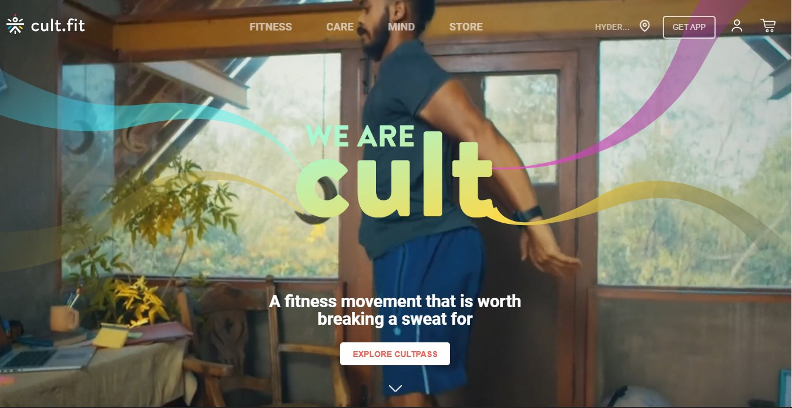
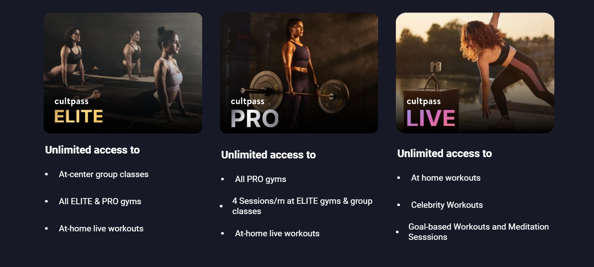
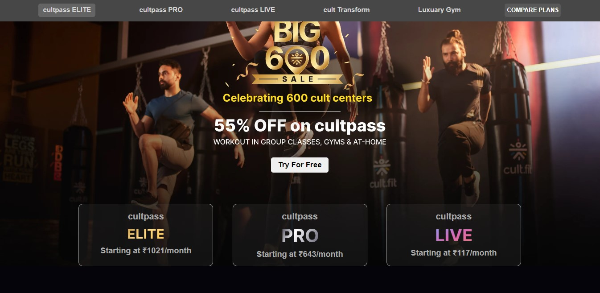
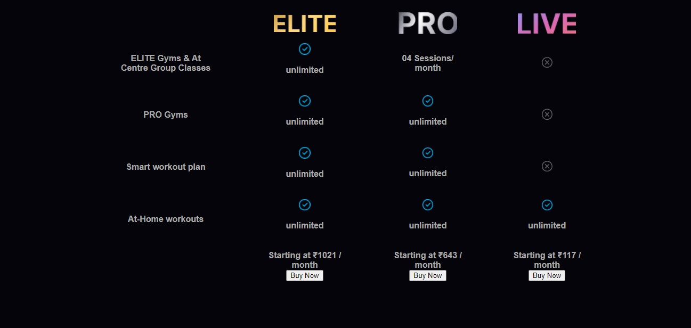
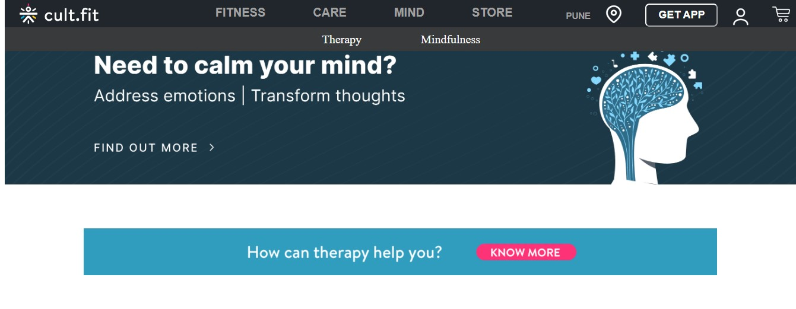
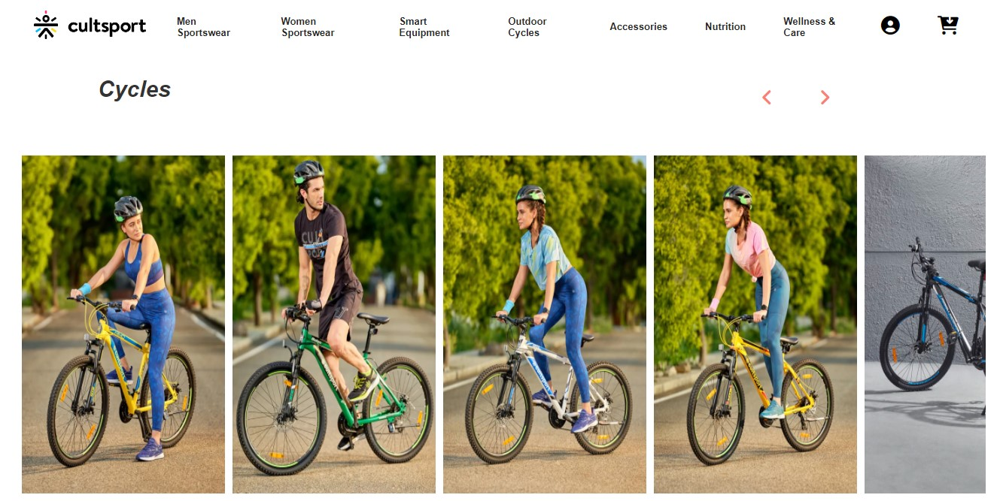

## Hello Everyone

This is a construct week project where we had clone Cultfit.com website with a team of 5 members and a duration of 5 days.

## About Website

Cultfit.com is a fitness based website with lot of services like yoga videos, training sessions and an ecommerce store where one can purchase a variety of fitness equipments and products.

## Tech Stack

- HTML
- CSS
- JavaScript
- ES6

## Tools

- Local Storage

## Features

- Login/signup functionality
- Add to cart
- Static pages and good User Interface

## Landing Page

## Fitness Page

## Mind Page

## Care Page

## Store Page

# 
